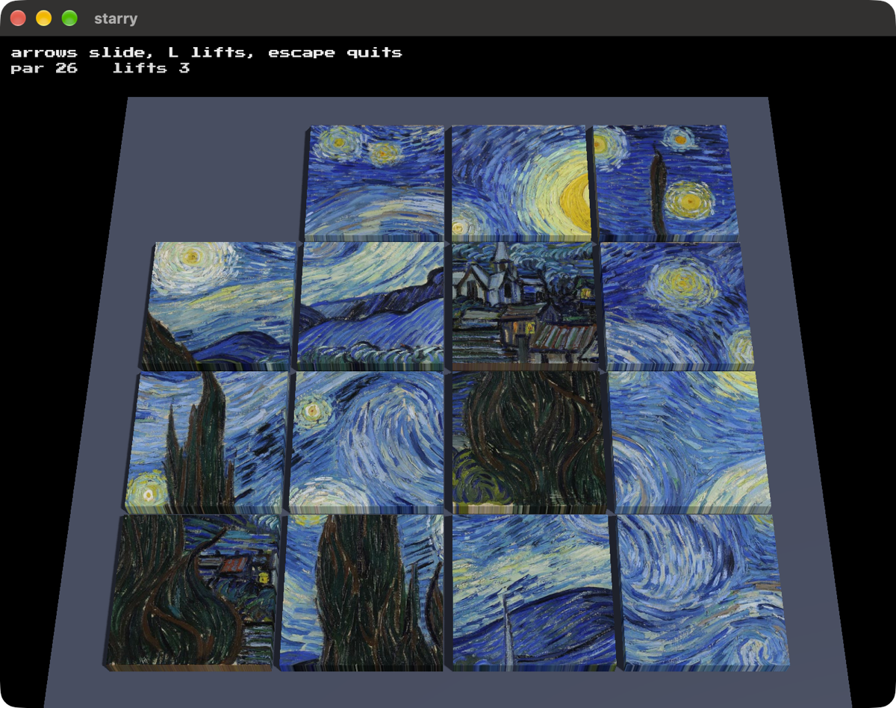

# starry

A sliding tile puzzle of Van Gogh's Starry Night, in tiles thick enough to cast
a shadow.
Fifteen slabs and a gap, and three lifts that take a tile out and put it down
anywhere, which is the thing you are really spending.

Built on [blitzkit](https://github.com/jvalol/blitzkit), the sixth game on that
engine and the third in 3D.

Nothing is built yet beyond the rules. `specs/0001-the-board.md` is the game,
and `src/board.rs` is the part of it that needs no window.

---

I asked AI to draft this for me. I've edited it. Any surviving AI smells are my oversight.
